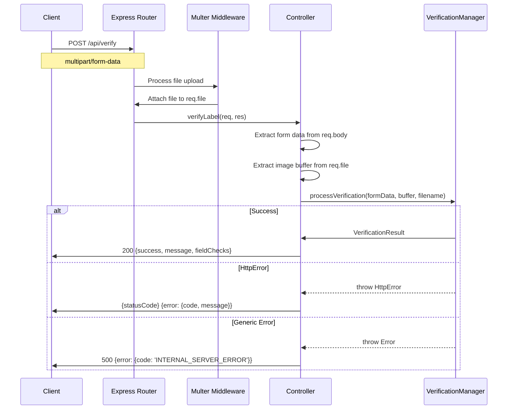

# API Layer

HTTP interface for the label verification system.

## Structure

```
api/
├── controllers/           # Request/response handlers
├── routes/               # Express route definitions
└── contracts/            # Request/response types
```

## Request Flow



## Controller

**VerificationController** - Handles verification requests

**Responsibilities**:
- Extract form data from request
- Extract uploaded file
- Call VerificationManager
- Format response
- Handle errors

**Error Handling**:
- Catches all errors from manager
- Checks if HttpError (has statusCode)
- Returns appropriate HTTP status
- Formats error response consistently

## Routes

**POST /api/verify**
- Uses Multer for multipart/form-data
- Single file upload: `image` field
- Memory storage (no disk writes)
- Calls VerificationController.verifyLabel

**GET /health**
- Simple health check endpoint
- Returns `{status: 'ok'}`

## Contracts

Type definitions for API requests and responses.

See `contracts/` directory for:
- Request payload types
- Response payload types
- Validation schemas

## Configuration

Multer configuration:
- Storage: memory (buffer)
- Field name: `image`
- No file filtering (validation done by ImageValidator)