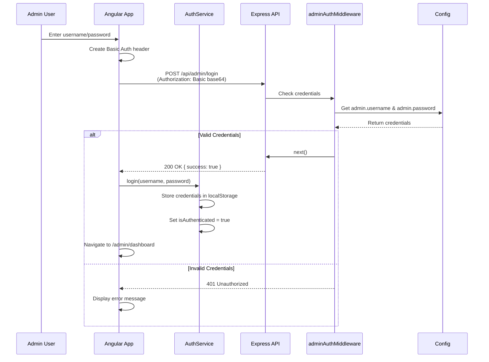
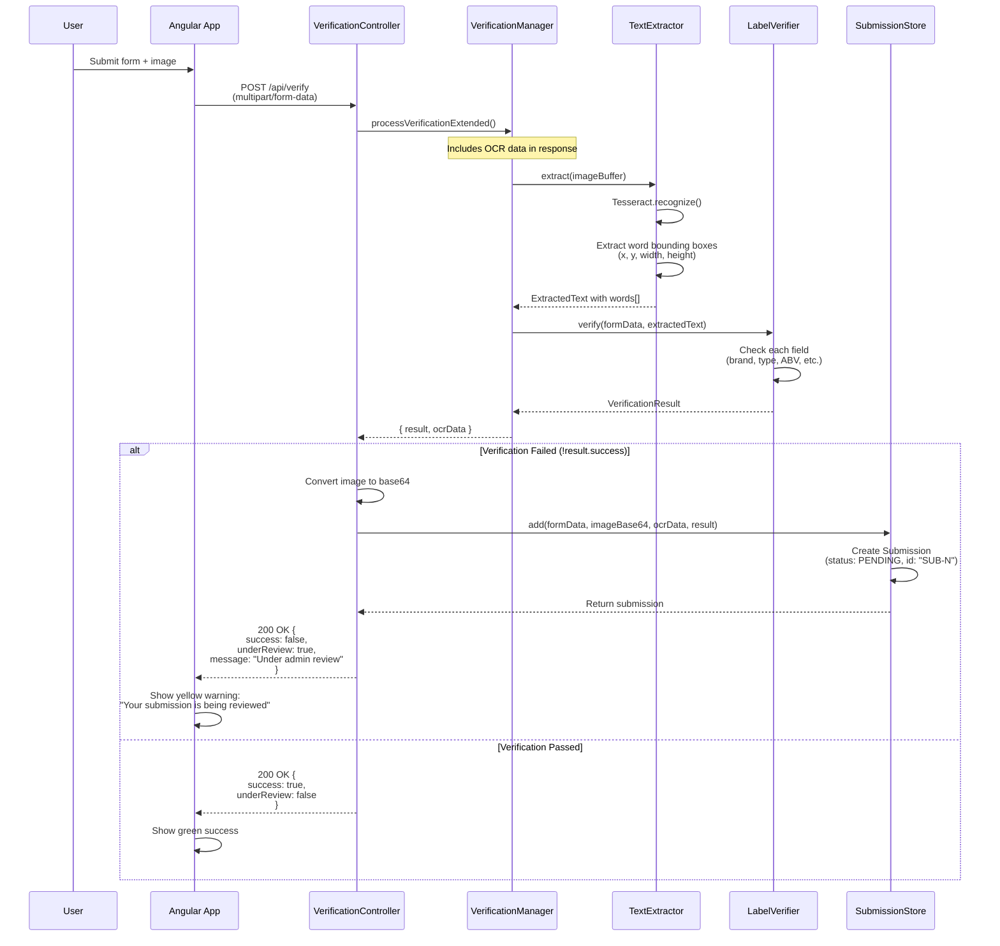
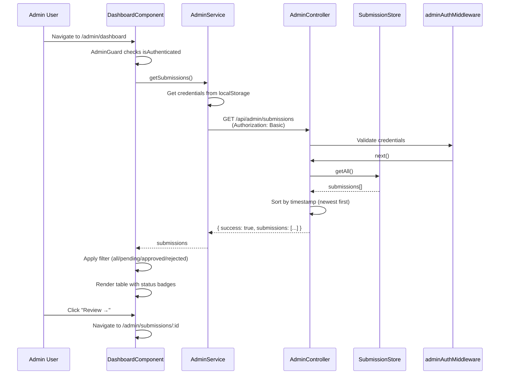
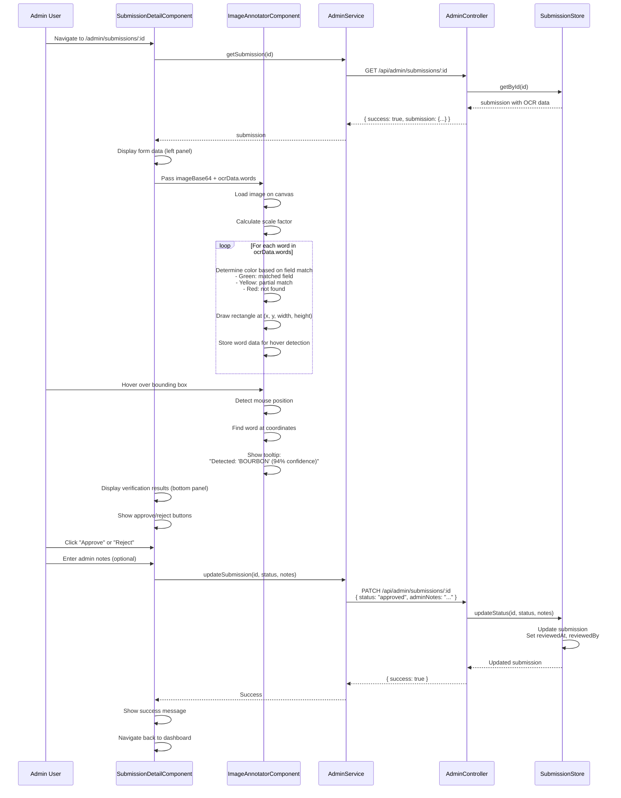
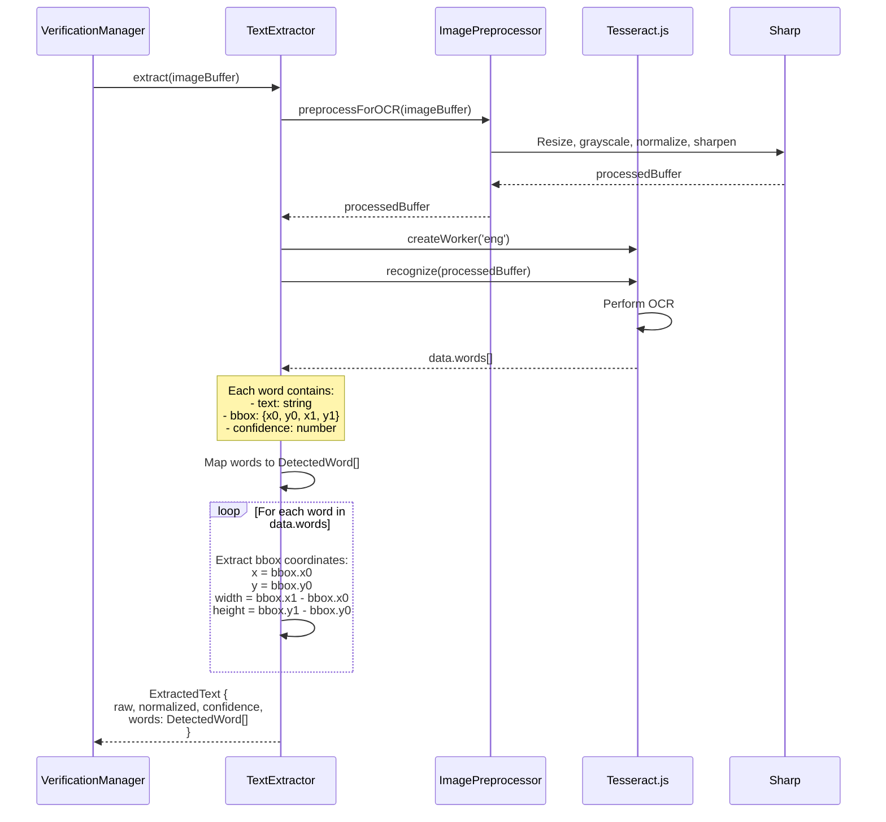
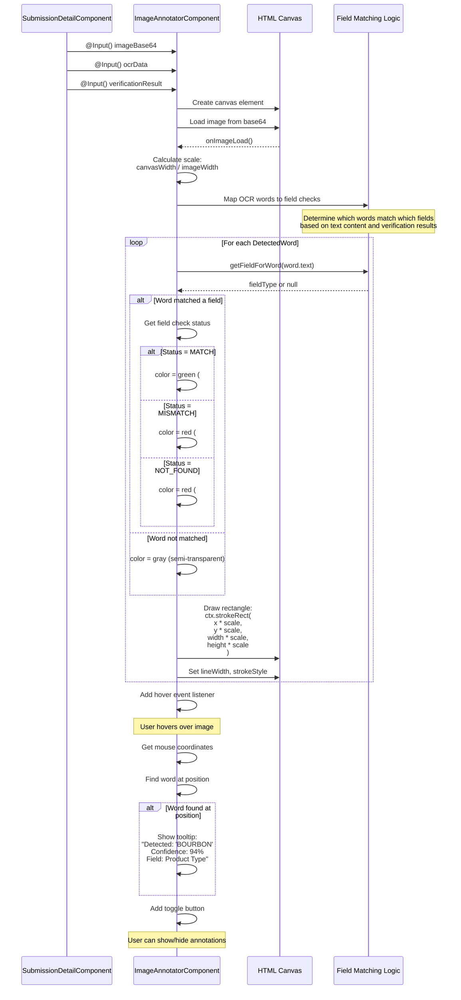

# Backend Architecture

TTB Label Verification System - High-level architecture overview.

## Directory Structure

```
src/
├── api/                    # HTTP layer
│   ├── controllers/        # Request handlers
│   └── routes/            # Express routes
├── services/
│   ├── manager/           # Business orchestration
│   │   └── label-verification/
│   │       └── manager.md
│   ├── engine/            # Core processing
│   │   ├── ocr/
│   │   │   └── ocr.md
│   │   └── verification/
│   │       └── verification.md
│   ├── validation/        # Input validation
│   │   └── validation.md
│   └── utility/           # Cross-cutting services
│       └── utilities.md
├── common/                # Shared types
└── config/                # Configuration
```

## System Layers

```
┌─────────────────────────────────────┐
│         API Layer                   │
│   Controllers + Express Routes      │
└─────────────────────────────────────┘
                 ↓
┌─────────────────────────────────────┐
│       Manager Layer                 │
│   Business Orchestration            │
└─────────────────────────────────────┘
                 ↓
┌─────────────────────────────────────┐
│       Engine Layer                  │
│   OCR + Verification Logic          │
└─────────────────────────────────────┘
                 ↓
┌─────────────────────────────────────┐
│       Utility Layer                 │
│   Validation + Preprocessing        │
└─────────────────────────────────────┘
```

## Main Endpoint

**POST /api/verify** - Verify label against form data

**Input**:
- Form fields: brandName, productType, alcoholContent, netContents (optional)
- File upload: Label image (JPEG, PNG, or WebP)

**Output**:
```json
{
  "success": true,
  "message": "Label matches form data",
  "fieldChecks": [
    {
      "fieldType": "BRAND_NAME",
      "status": "MATCH",
      "message": "Brand name found on label",
      "expected": "Old Tom Distillery",
      "found": "Old Tom Distillery"
    }
  ]
}
```

## Request Flow

1. **API Layer** receives multipart/form-data
2. **Manager** coordinates verification:
   - Field validation
   - Image validation
   - OCR extraction
   - Label verification
3. **Response** sent to client

## Detailed Documentation

### Core Layers
- [API Layer](./api/api.md) - Controllers, routes, and HTTP interface
- [Manager Layer](./services/manager/label-verification/manager.md) - Request orchestration
- [Validation](./services/validation/validation.md) - Form field validation
- [OCR Engine](./services/engine/ocr/ocr.md) - Text extraction
- [Verification Engine](./services/engine/verification/verification.md) - Label matching
- [Utilities](./services/utility/utilities.md) - Image processing, normalization, logging

### Supporting
- [Common Types](./common/common.md) - Shared types and enums
- [Configuration](./config.md) - Application settings and environment variables

## Configuration

See `config.ts` for:
- OCR settings (language, thresholds)
- Image constraints (size, formats)
- Verification tolerances
- Required warning text

## Error Handling

- **400** - Invalid form data
- **401** - Unauthorized (admin authentication failed)
- **422** - Invalid image or OCR failure
- **500** - Internal server error

All errors return:
```json
{
  "error": {
    "code": "ERROR_CODE",
    "message": "Human-readable message"
  }
}
```

---

# Admin System Architecture

## Overview

The admin system provides manual review capabilities for label verifications that fail automatic validation. When a verification fails, the submission is automatically saved to an in-memory store with OCR bounding box data, allowing admins to visually inspect what the AI detected and approve or reject submissions.

## Directory Structure

```
src/
├── storage/                    # NEW: Submission storage
│   ├── contracts/
│   │   └── submission.ts       # Submission model & status enum
│   └── implementation/
│       └── submission.store.ts # In-memory submission storage
├── api/
│   ├── controllers/
│   │   ├── verification.controller.ts  # UPDATED: Auto-saves failed verifications
│   │   └── admin.controller.ts         # NEW: Admin endpoints
│   ├── routes/
│   │   └── admin.routes.ts              # NEW: Admin routes
│   └── middleware/
│       └── admin-auth.middleware.ts     # NEW: Basic auth for admin
└── config.ts                    # UPDATED: Admin credentials
```

## Admin API Endpoints

**POST /api/admin/login** - Authenticate admin user
- Auth: Basic Auth (username/password in header or body)
- Returns: `{ success: true, message: "Login successful" }`

**GET /api/admin/submissions** - List all submissions
- Auth: Basic Auth required
- Query params: `status` (optional: pending|approved|rejected)
- Returns: `{ success: true, count: N, submissions: [...] }`

**GET /api/admin/submissions/:id** - Get submission details
- Auth: Basic Auth required
- Returns: `{ success: true, submission: {...} }` with OCR bounding boxes

**PATCH /api/admin/submissions/:id** - Update submission status
- Auth: Basic Auth required
- Body: `{ status: "approved|rejected", adminNotes?: string, reviewedBy?: string }`
- Returns: `{ success: true, submission: {...} }`

## Authentication

Simple hardcoded credentials stored in `config.ts`:
- Username: `admin` (or `process.env.ADMIN_USERNAME`)
- Password: `admin123` (or `process.env.ADMIN_PASSWORD`)

Uses HTTP Basic Authentication - credentials sent as base64-encoded `Authorization: Basic` header.

## Data Model

### Submission
```typescript
interface Submission {
  id: string;                           // e.g. "SUB-1"
  formData: FormData;                   // User's form input
  imageBase64: string;                  // Uploaded label image
  ocrData: ExtractedText;               // OCR results WITH bounding boxes
  verificationResult: VerificationResult; // Field check results
  status: SubmissionStatus;             // pending | approved | rejected
  timestamp: Date;                      // When submitted
  adminNotes?: string;                  // Admin review notes
  reviewedAt?: Date;                    // When reviewed
  reviewedBy?: string;                  // Who reviewed it
}
```

### ExtractedText (Enhanced with Bounding Boxes)
```typescript
interface ExtractedText {
  raw: string;           // Raw OCR text
  normalized: string;    // Normalized text
  confidence: number;    // Overall confidence
  words: DetectedWord[]; // NEW: Word-level bounding boxes
}

interface DetectedWord {
  text: string;
  bbox: {
    x: number;          // Pixel coordinates
    y: number;
    width: number;
    height: number;
  };
  confidence: number;   // Per-word confidence
}
```

---

## Flow Diagrams

### 1. Admin Login Flow



### 2. Auto-Save Failed Verification Flow



### 3. Admin Dashboard Flow



### 4. Submission Review Flow (with Image Annotation)



### 5. OCR Bounding Box Extraction



### 6. Image Annotator Rendering



## Storage Layer

### SubmissionStore (In-Memory)

```typescript
class SubmissionStore {
  private submissions: Submission[] = [];
  private idCounter: number = 1;

  add(formData, imageBase64, ocrData, verificationResult): Submission
  getAll(status?: SubmissionStatus): Submission[]
  getById(id: string): Submission | undefined
  updateStatus(id, status, adminNotes?, reviewedBy?): Submission | undefined
  getCount(status?: SubmissionStatus): number
}
```

**Note:** Current implementation uses in-memory storage. Submissions are lost on server restart. For production, this should be replaced with a database (PostgreSQL, MongoDB, etc.).

## Configuration Updates

### config.ts - Admin Section

```typescript
admin: {
  username: process.env.ADMIN_USERNAME || 'admin',
  password: process.env.ADMIN_PASSWORD || 'admin123',
}
```

## Security Considerations

1. **Credentials Storage:** Admin credentials are hardcoded in config for MVP. In production:
   - Use environment variables
   - Hash passwords with bcrypt
   - Consider JWT tokens instead of Basic Auth

2. **CORS:** Admin endpoints should have stricter CORS policies in production

3. **Rate Limiting:** Add rate limiting to prevent brute force attacks on login

4. **Session Management:** Current implementation stores credentials in localStorage. Consider:
   - HTTP-only cookies
   - Short-lived JWT tokens
   - Refresh token rotation

## Future Enhancements

1. **Persistent Storage:** Replace in-memory store with database
2. **Multi-User Admin:** Support multiple admin users with different permissions
3. **Audit Logging:** Track all admin actions
4. **Real-time Updates:** WebSocket notifications when new submissions arrive
5. **Batch Operations:** Approve/reject multiple submissions at once
6. **Advanced Filtering:** Search by brand, date range, OCR confidence
7. **Export Functionality:** Download submissions as CSV/PDF reports
