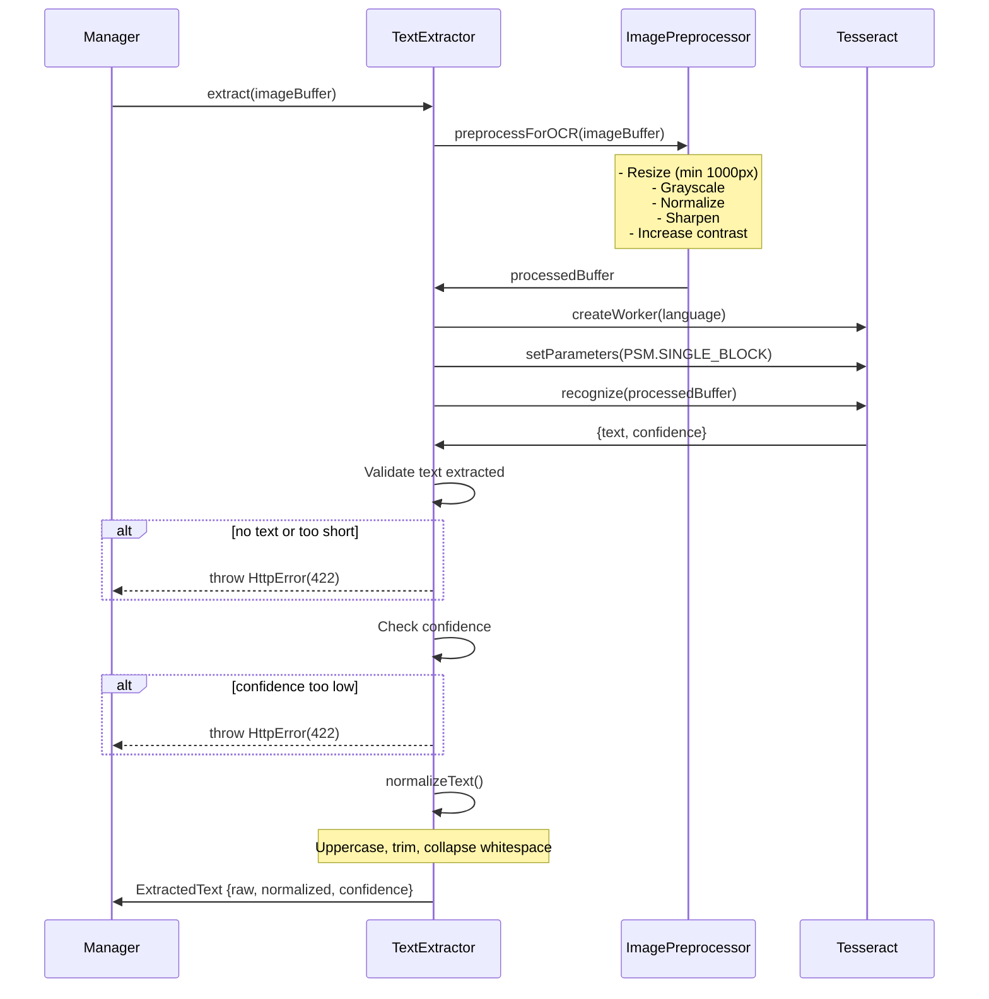

# OCR Text Extraction

Extracts text from label images using Tesseract.

## Flow

## Image Preprocessing

Uses Sharp library for:
- Resize to minimum 1000px
- Grayscale conversion
- Contrast normalization
- Edge sharpening (sigma: 1.5)
- Contrast enhancement

## Configuration

From `config.ts`:
- `ocr.language` - Tesseract language
- `ocr.minTextLength` - Minimum extracted text length
- `ocr.minConfidence` - Minimum OCR confidence threshold

## Errors

Returns HTTP 422 for:
- No text extracted
- Insufficient text length
- Low OCR confidence