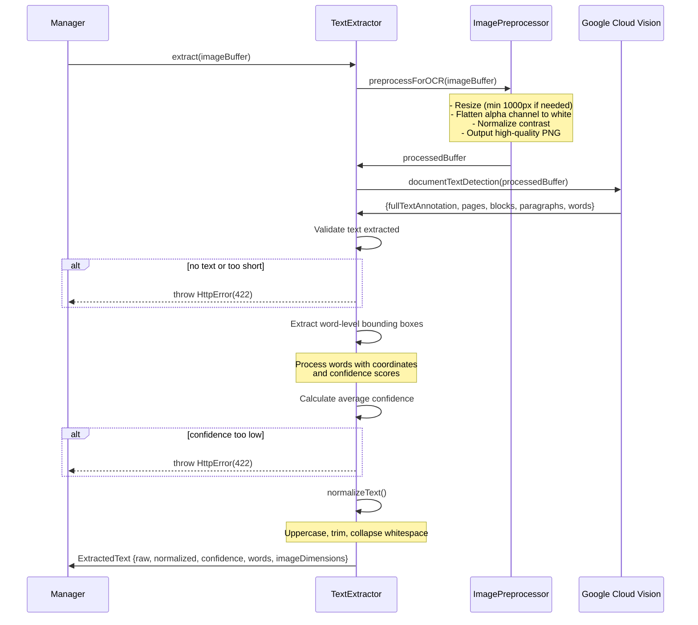

# OCR Text Extraction

Extracts text from label images using Google Cloud Vision API.

## Flow

## Image Preprocessing

Uses Sharp library for:
- Resize to minimum 1000px (only if smaller, maintains aspect ratio)
- Flatten transparent backgrounds to white
- Normalize contrast (histogram spreading)
- Output as uncompressed PNG for maximum quality

## Configuration

From `config.ts`:
- `image.minDimensionForOCR` - Minimum dimension for upscaling (1000px)
- `ocr.minTextLength` - Minimum extracted text length (3 characters)
- `ocr.minConfidence` - Minimum OCR confidence threshold (30%)

## Credentials

Supports two authentication methods:
- **Local**: `GOOGLE_APPLICATION_CREDENTIALS` - path to JSON key file
- **Vercel**: `GOOGLE_APPLICATION_CREDENTIALS_JSON` - JSON string in environment variable

## Output

Returns `ExtractedText` with:
- `raw` - Original extracted text
- `normalized` - Uppercased, whitespace-collapsed text
- `confidence` - Average word confidence (0-100%)
- `words` - Array of detected words with bounding boxes and confidence
- `imageDimensions` - Original and processed image dimensions
- `processedImageBuffer` - The preprocessed image sent to OCR

## Errors

Returns HTTP 422 for:
- No text extracted from image
- Insufficient text length (< 3 characters)
- Low OCR confidence (< 30%)
- Invalid Google Cloud credentials