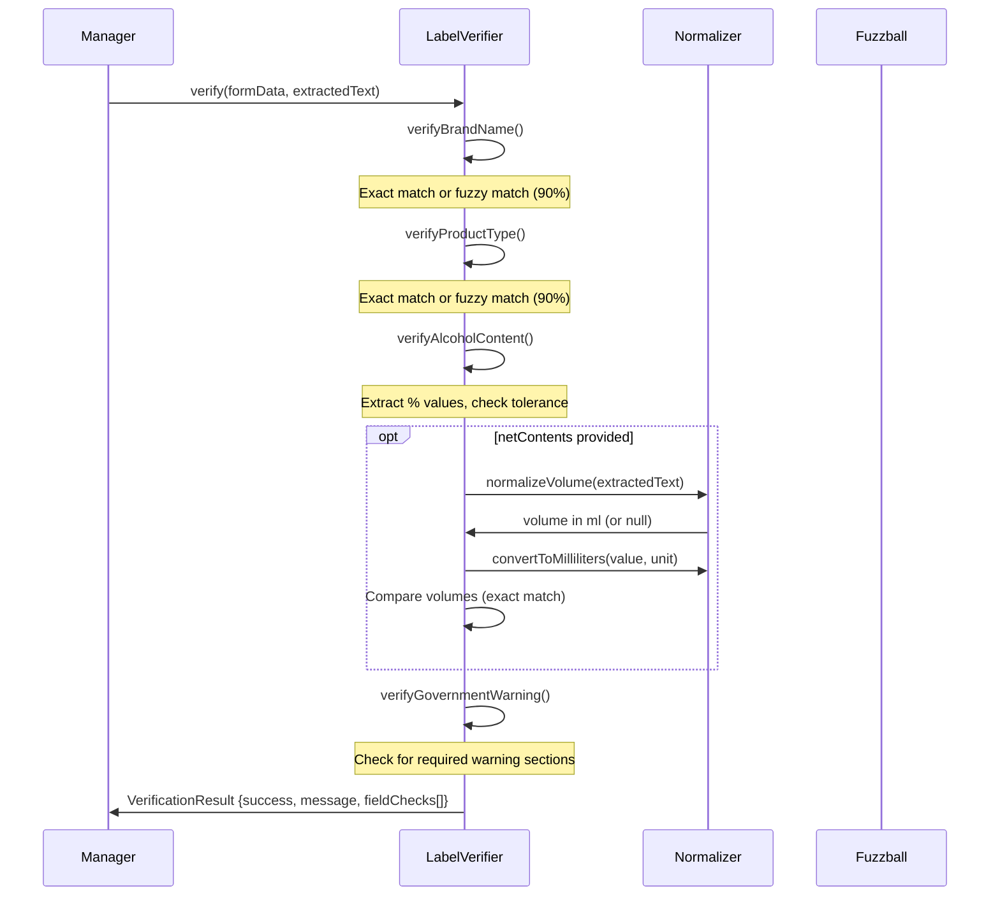

# Label Verification

Verifies form data against extracted label text.

## Flow

## Field Checks

Each field returns a `FieldCheck` with:
- `fieldType` - Field being verified
- `status` - MATCH, MISMATCH, or NOT_FOUND
- `message` - Human-readable result
- `expected` - Expected value
- `found` - Found value (if applicable)

### Brand Name
- Exact match (case-insensitive)
- Fuzzy match ≥90% using fuzzball

### Product Type
- Same logic as brand name

### Alcohol Content
- Extracts all "X%" patterns
- Checks if any within tolerance (from config)

### Net Contents
- Normalizes volume to milliliters
- Exact match required

### Government Warning
- Checks for required sections (from config)
- Must find all sections for MATCH

## Volume Normalization

Searches for volume patterns in order:
1. FL OZ / FLOZ
2. GAL / GALLON
3. OZ (standalone)
4. MILLILITERS / MILLILITRES
5. CENTILITERS / CENTILITRES
6. LITERS / LITRES
7. ML, CL, L (abbreviations)

Converts all to milliliters for comparison.

## Configuration

From `config.ts`:
- `verification.alcoholContentTolerance` - Tolerance for % matching
- `verification.governmentWarningMinSections` - Required sections count
- `requiredTexts.governmentWarning` - Full warning text
- `requiredTexts.governmentWarningSections` - Array of required sections