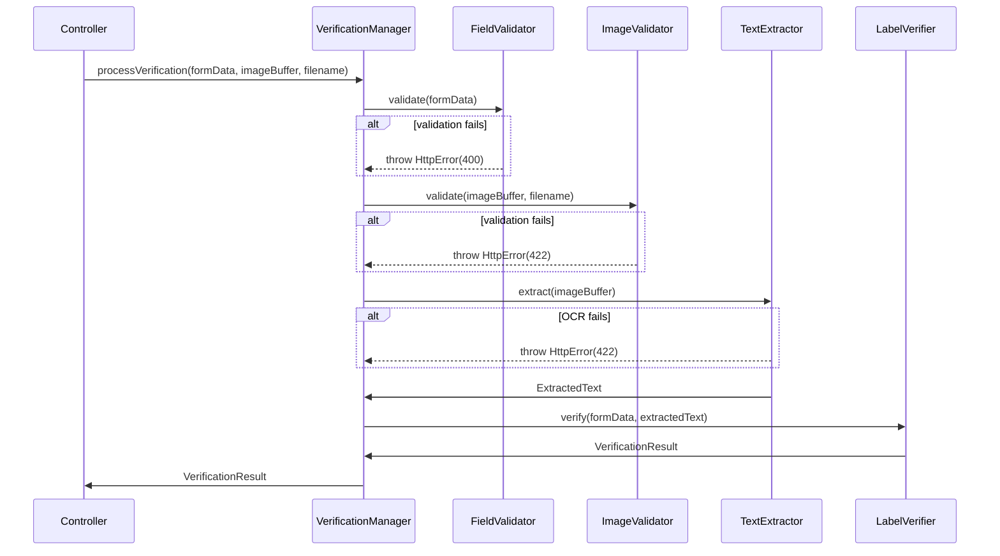

# Verification Manager

Orchestrates the entire label verification process.

## Flow

## Initialization

Dependencies are injected in order:
1. FieldValidator
2. ImageValidator
3. TextExtractor
4. LabelVerifier
5. ConsoleLogger

See app.ts for dependency wiring.

## Processing Steps

1. **Field Validation** - See [validation.md](../../validation/validation.md)
2. **Image Validation** - See [utilities.md](../../utility/utilities.md)
3. **Text Extraction** - See [ocr.md](../../engine/ocr/ocr.md)
4. **Label Verification** - See [verification.md](../../engine/verification/verification.md)