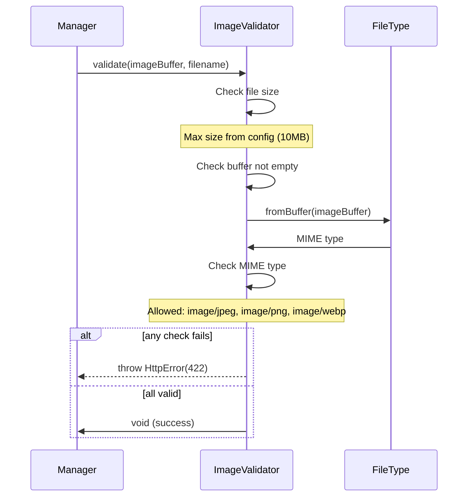

# Utility Services

Cross-cutting services used throughout the application.

## Services

### Image Validator
Validates uploaded images before processing.

**Configuration**: `image.maxFileSizeMB` (default: 10MB)

**Allowed formats**: JPEG, PNG, WebP

---

### Image Preprocessor
Prepares images for OCR processing.

**Steps**:
s1. Resize to minimum 1000px dimension (if needed, maintains aspect ratio)
2. Flatten alpha channel to white background (if transparent)
3. Normalize contrast (histogram spreading)
4. Output as uncompressed PNG (quality 100, compressionLevel 0)

Uses Sharp library for all transformations.

**Configuration**: `image.minDimensionForOCR` (default: 1000px)

---

### Normalizer
Text and volume normalization utilities.

**Functions**:
- `normalizeVolume()` - Extract and normalize volume from text
- `convertToMilliliters()` - Convert volume units to ml

See [verification.md](../engine/verification/verification.md) for volume normalization details.

