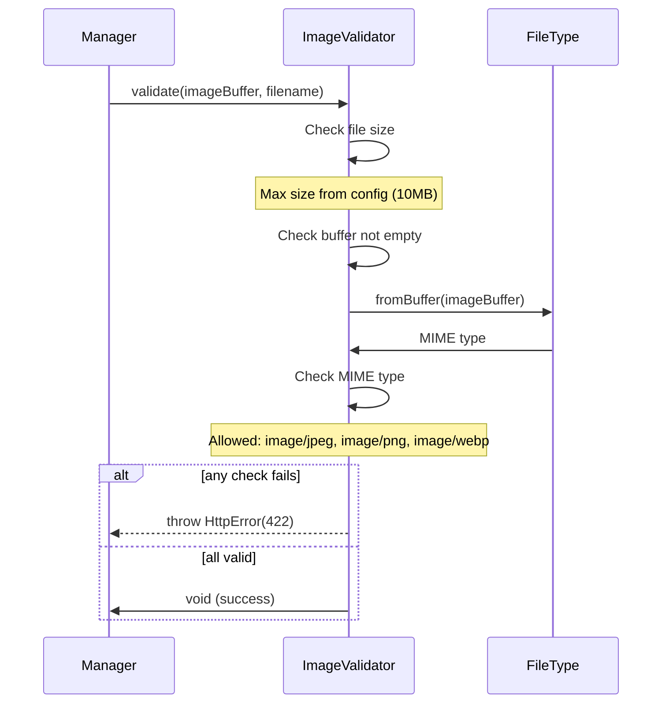

# Utility Services

Cross-cutting services used throughout the application.

## Services

### Image Validator
Validates uploaded images before processing.

**Configuration**: `image.maxFileSizeMB` (default: 10MB)

**Allowed formats**: JPEG, PNG, WebP

---

### Image Preprocessor
Prepares images for OCR processing.

**Steps**:
1. Resize to minimum 1000px dimension
2. Convert to grayscale
3. Normalize contrast
4. Sharpen edges (sigma: 1.5)
5. Increase contrast

Uses Sharp library for all transformations.

---

### Normalizer
Text and volume normalization utilities.

**Functions**:
- `normalizeVolume()` - Extract and normalize volume from text
- `convertToMilliliters()` - Convert volume units to ml

See [verification.md](../engine/verification/verification.md) for volume normalization details.

---

### Console Logger
Structured logging to console.

**Methods**:
- `info(message, meta?)` - Info level
- `warn(message, meta?)` - Warning level
- `error(message, error?, meta?)` - Error level
- `debug(message, meta?)` - Debug level

**Configuration**:
- `logging.enabled` - Enable/disable logging
- `logging.level` - Minimum log level (debug, info, warn, error)

Outputs JSON-formatted logs with timestamps.