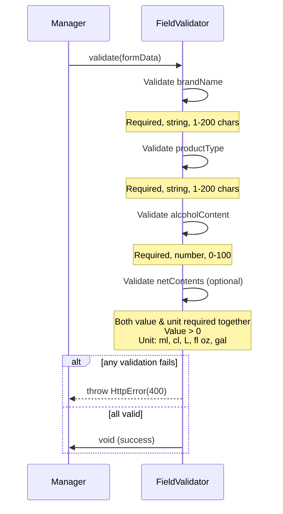

# Field Validation

Validates incoming form data before processing.

## Flow

## Rules

### Brand Name
- Required, string, 1-200 chars (trimmed)

### Product Type
- Required, string, 1-200 chars (trimmed)

### Alcohol Content
- Required, number, 0-100

### Net Contents
- Optional (both value and unit together)
- Value: number > 0
- Unit: `ml`, `cl`, `L`, `fl oz`, `gal`
- If one provided, both required

## Errors

Returns HTTP 400 with specific validation message.