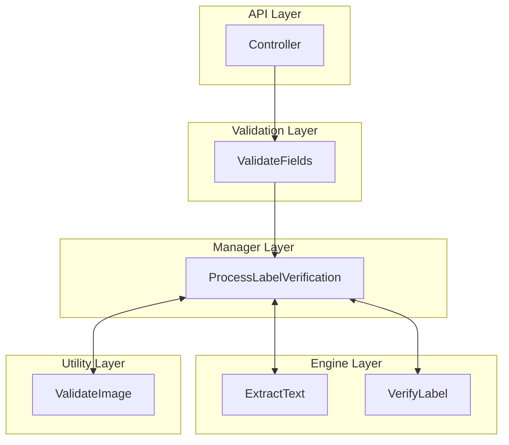

# Backend Architecture - TTB Label Verification App

## Architecture Overview

### Services Required
- Validation Services - Validate input data before processing
- Manager Services - Orchestrate verification workflow
- Engine Services - OCR processing and field verification
- Utility Services - Image file validation

### Services NOT Needed
- Accessor Services - No database required
- Database - Stateless application

---

## Architecture Diagram



---

## Project Structure

### Modular Structure (Recommended)
```
backend/
├── src/
│   ├── api/
│   │   ├── routes/
│   │   ├── contracts/              # HTTP layer contracts
│   │   │   ├── requests/          # Request DTOs
│   │   │   └── responses/         # Response DTOs
│   │   └── mappers/               # API ↔ Domain mapping
│   │
│   ├── services/
│   │   ├── validation/
│   │   │   └── field-validation/
│   │   │       ├── contracts/
│   │   │       ├── interface/
│   │   │       ├── implementation/
│   │   │       ├── mappers/
│   │   │       └── tests/
│   │   │
│   │   ├── manager/
│   │   │   └── label-verification/
│   │   │       ├── contracts/
│   │   │       ├── interface/
│   │   │       ├── implementation/
│   │   │       ├── mappers/
│   │   │       └── tests/
│   │   │
│   │   ├── engine/
│   │   │   └── ocr/
│   │   │       ├── contracts/
│   │   │       ├── interface/
│   │   │       ├── implementation/
│   │   │       ├── mappers/
│   │   │       └── tests/
│   │   │
│   │   └── utility/
│   │       └── image-processing/
│   │           ├── contracts/
│   │           ├── interface/
│   │           ├── implementation/
│   │           └── tests/
│   │
│   ├── common/
│   │   ├── contracts/             # Shared domain models
│   │   ├── enums/
│   │   ├── exceptions/
│   │   └── fakers/
│   │
│   └── index.ts                   # Application entry point
│
└── tests/
    ├── integration/
    └── fixtures/
```

### Serverless Structure (Alternative for Vercel/AWS Lambda)
```
backend/
├── api/
│   └── verify.ts                  # Single serverless function
│
└── lib/
    ├── services/                  # Same service structure
    ├── common/                    # Same common structure
    └── tests/
```

---

## Service Layers

### API Layer
HTTP endpoint handling and DTO mapping.

**Controller**
- Receive HTTP requests
- Parse multipart form data
- Map request DTOs to domain models
- Call validation layer
- Map domain models to response DTOs
- Return HTTP responses

### Validation Layer
Validate input data before processing.

**ValidateFields**
- Validate field requirements
- Validate field formats
- Validate field constraints
- Throw validation exceptions

### Manager Layer
Orchestrate workflows across multiple services.

**ProcessLabelVerification**
1. Validate image file
2. Extract text via OCR
3. Verify extracted text against form data
4. Return result

### Engine Layer
Core business logic and processing.

**ExtractText**
- Extract text from images using OCR
- Normalize and clean text
- Return structured result with confidence score

**VerifyLabel**
- Compare form data with extracted text
- Verify each field using matching rules
- Return field-by-field comparison
- Report all discrepancies

### Utility Layer
File processing helpers.

**ValidateImage**
- Validate file size and type
- Verify format (JPEG/PNG)
- Check file integrity

---


## Contracts and Mapping Strategy

### Layer Contracts
Each layer defines its own contracts:
- **API Contracts** - HTTP request/response DTOs
- **Service Contracts** - Service-specific input/output models
- **Domain Contracts** - Shared domain models (in common/)

### Mappers
Mappers exist at each layer boundary:
- **API Mappers** - Map HTTP DTOs ↔ Domain models
- **Service Mappers** - Map between service contracts and domain models
- **Cross-Service Mappers** - Map between different service contracts

### Mapping Flow
```
HTTP Request DTO
    ↓ (API Mapper)
Domain Model
    ↓ (Service Mapper)
Service Contract
    ↓ (Business Logic)
Service Contract
    ↓ (Service Mapper)
Domain Model
    ↓ (API Mapper)
HTTP Response DTO
```

---

## Design Principles

1. **Separation of Concerns** - Each layer has distinct responsibility
2. **Fail Fast** - Validation layer validates before processing
3. **Interface-First** - All services defined by interfaces
4. **Dependency Injection** - Services injected, not instantiated
5. **Contract Independence** - Each layer has its own contracts
6. **Explicit Mapping** - Never pass DTOs directly between layers
7. **Stateless** - No persistence layer required
8. **Technology Agnostic** - Structure works with any language/framework

---

## Layer Order

```
API Layer
    ↓
Validation Layer (validate input)
    ↓
Manager Layer (orchestrate workflow)
    ↓
Engine Layer + Utility Layer (process and verify)
```
