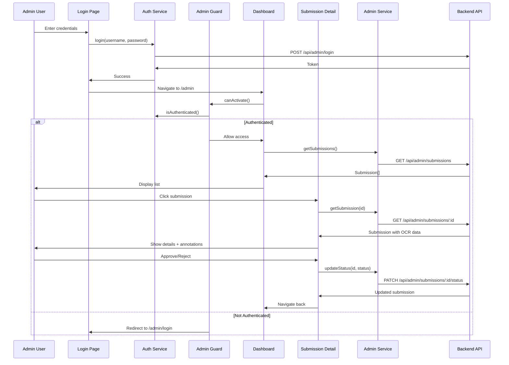

# Admin Feature

Administrative dashboard for reviewing and managing label verification submissions.

## Structure

```
admin/
├── components/
│   └── image-annotator/       # Canvas-based OCR annotation display
├── guards/
│   └── admin.guard.ts        # Route protection (auth required)
├── pages/
│   ├── login/                # Admin login page
│   ├── dashboard/            # Submissions list page
│   └── submission-detail/    # Individual submission review
└── services/
    └── admin.service.ts      # Admin API calls
```

## Flow



## Components

### Image Annotator
Canvas-based component for displaying OCR bounding boxes over label images with interactive tooltips.

**Location:** `components/image-annotator/`

**Features:**
- Renders label image on HTML5 canvas
- Draws color-coded bounding boxes around detected words
- Interactive tooltips on hover showing word text, confidence, and field type
- Toggle annotations on/off
- Supports multiple images with per-image word filtering
- Responsive canvas sizing with proper coordinate normalization

**Inputs:**
- `imageBase64: string` - Base64-encoded label image
- `ocrData: ExtractedText` - Complete OCR results with all detected words
- `verificationResult: VerificationResult` - Field verification results for color coding
- `imageIndex: number` - Index of image (0 for primary, 1 for secondary)

**Rendering:**
- Color-coded bounding boxes:
  - Green: Text matches expected values
  - Red: Mismatched or not found text
  - Cyan: Other detected text
- Interactive tooltips show on hover:
  - Detected word text
  - OCR confidence score percentage
  - Associated field type (if applicable)
- Toggle button to show/hide annotations
- Color-coded legend for understanding box colors
- Canvas scales to fit container (max 600px height) while maintaining aspect ratio
- Mouse coordinate normalization accounts for CSS scaling

---

## Pages

### Login Page
Admin authentication page.

**Location:** `pages/login/`

**Route:** `/admin/login`

**Features:**
- Username and password fields
- Form validation
- Error display for failed login
- Redirects to dashboard on success

**Flow:**
1. Admin enters credentials
2. Calls AuthService.login()
3. On success, navigate to `/admin`
4. On error, display error message

---

### Dashboard Page
Lists all submissions with filtering.

**Location:** `pages/dashboard/`

**Route:** `/admin`

**Features:**
- Display all submissions in table/list
- Filter by status (All, Pending, Approved, Rejected)
- Show submission metadata:
  - Timestamp
  - Brand name
  - Status
  - Verification result (passed/failed)
- Click submission to view details
- Logout button

**Filtering:**
- All: Show all submissions
- Pending: Show only pending submissions
- Approved: Show only approved submissions
- Rejected: Show only rejected submissions

**Protected Route:**
- Requires authentication (AdminGuard)
- Redirects to login if not authenticated

---

### Submission Detail Page
Detailed view of a single submission with OCR annotations.

**Location:** `pages/submission-detail/`

**Route:** `/admin/submissions/:id`

**Features:**
- Display multiple label images (primary and secondary) with OCR bounding boxes
- Show extracted text from OCR with confidence scores
- Display form data submitted by user
- Show field-by-field verification results
- Approve/Reject buttons in header
- Admin notes textarea for pending submissions
- Back to dashboard link

**Layout:**
- Two-column grid (left: form data and results, right: annotated images)
- Header with Approve/Reject action buttons
- Responsive design for mobile/tablet/desktop

**Sections:**
1. **Form Data** - User-submitted field values
2. **Verification Results** - Field-by-field check status with OCR confidence
3. **Admin Notes** - Textarea for adding review notes (pending only) or displaying saved notes (approved/rejected)
4. **Label Images** - One or two annotated images with interactive tooltips

**Actions:**
- Approve: Change status to "approved", saves admin notes, navigates to dashboard
- Reject: Change status to "rejected", requires admin notes, navigates to dashboard
- Updates via AdminService.updateSubmissionStatus()

**Protected Route:**
- Requires authentication (AdminGuard)

---

## Services

### Admin Service

Handles API communication for admin operations.

**Location:** `services/admin.service.ts`

**Methods:**

**`getSubmissions(status?: SubmissionStatus): Observable<Submission[]>`**
- Fetches all submissions from backend
- Optional status filter (pending, approved, rejected)
- Calls `GET /api/admin/submissions?status={status}`

**`getSubmission(id: string): Observable<Submission>`**
- Fetches single submission by ID
- Includes full OCR data and bounding boxes
- Calls `GET /api/admin/submissions/:id`

**`updateSubmissionStatus(id: string, status: SubmissionStatus): Observable<Submission>`**
- Updates submission status
- Calls `PATCH /api/admin/submissions/:id/status`
- Returns updated submission

**Error Handling:**
- Catches HTTP errors
- Returns user-friendly error messages
- Shows toast notifications on errors

---

## Guards

### Admin Guard

Route guard for protecting admin routes.

**Location:** `guards/admin.guard.ts`

**Purpose:**
- Prevent unauthorized access to admin pages
- Redirect to login if not authenticated

**Implementation:**
```typescript
canActivate(): boolean {
  if (authService.isAuthenticated()) {
    return true;
  }
  router.navigate(['/admin/login']);
  return false;
}
```

**Protected Routes:**
- `/admin` (dashboard)
- `/admin/submissions/:id` (detail)

**Unprotected Route:**
- `/admin/login` (public access)

---

## Routes

```typescript
{
  path: 'admin',
  children: [
    {
      path: 'login',
      component: LoginPageComponent
    },
    {
      path: '',
      component: DashboardPageComponent,
      canActivate: [AdminGuard]
    },
    {
      path: 'submissions/:id',
      component: SubmissionDetailPageComponent,
      canActivate: [AdminGuard]
    }
  ]
}
```

---

## Authentication

**Storage:**
- Auth token stored in localStorage
- Key: `auth_token`
- Set on login, cleared on logout

**Authorization:**
- Token sent in Authorization header for admin API calls
- Backend validates token for protected endpoints

**Session Management:**
- Token persists across page refreshes
- Logout clears token and redirects to login