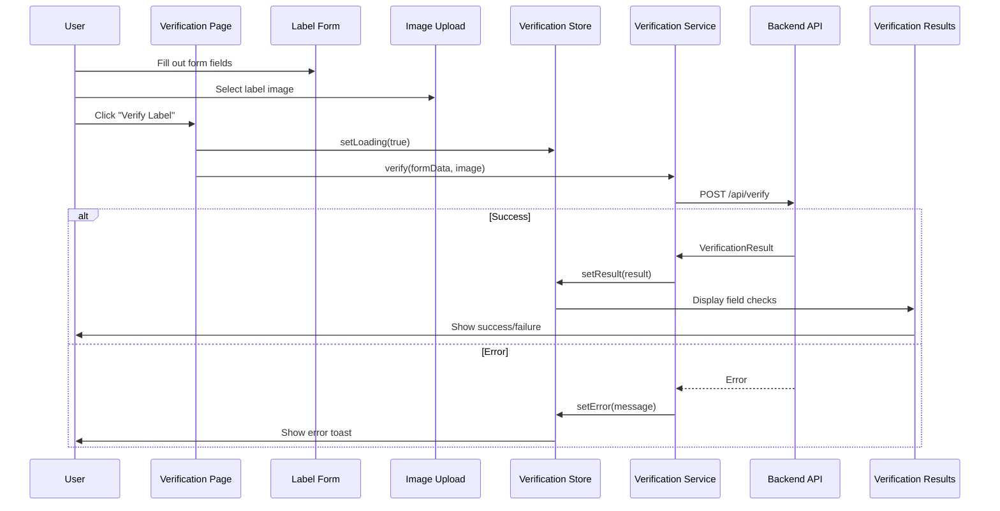

# Label Verification Feature

User-facing feature for submitting alcohol labels and form data for automated verification.

## Structure

```
label-verification/
├── components/
│   ├── image-upload/           # Image file upload component
│   ├── label-form/            # Form inputs for label data
│   ├── verification-modal/    # Loading modal during verification
│   └── verification-results/  # Display verification results
├── pages/
│   └── verification-page/     # Main container page
├── services/
│   └── verification.service.ts # API calls for verification
└── store/
    ├── verification.store.ts           # State management with signals
    └── verification-store-state.model.ts # Store state interface
```

## Flow



## Components

### Label Form
Smart component for collecting label information.

**Location:** `components/label-form/`

**Inputs:**
- Brand Name (required)
- Product Type (required)
- Alcohol Content % (required, number 0-100)
- Net Contents Value (optional)
- Net Contents Unit (optional, dropdown: ml, cl, L, fl oz, gal)

**Validation:**
- All required fields must be filled
- Alcohol content must be 0-100
- Net contents value and unit must both be provided together
- Uses Angular FormGroup with reactive forms

**Outputs:**
- `formSubmit: EventEmitter<LabelFormData>` - Emits valid form data

---

### Image Upload
Component for uploading label images.

**Location:** `components/image-upload/`

**Features:**
- Drag-and-drop file upload
- Click to browse file selector
- Image preview after selection
- File validation (JPEG, PNG, WEBP, max 10MB)
- Clear/remove uploaded image

**Outputs:**
- `imageSelected: EventEmitter<File>` - Emits selected image file

**Validation:**
- File type: image/jpeg, image/png, image/webp
- File size: max 10MB
- Shows error if invalid file selected

---

### Verification Modal
Loading overlay during verification processing.

**Location:** `components/verification-modal/`

**Purpose:**
- Display loading spinner while API request is in progress
- Block user interaction during verification
- Show "Verifying label..." message

**Triggers:**
- Opens when verification starts
- Closes when result received or error occurs

---

### Verification Results
Displays field-by-field verification results.

**Location:** `components/verification-results/`

**Display:**
- Overall status (APPROVED or PENDING)
- Field checks for each verified field:
  - Brand Name
  - Product Type
  - Alcohol Content
  - Net Contents (if provided)
  - Government Warning
- Visual indicators:
  - ✓ Green checkmark = MATCH
  - ✗ Red X = MISMATCH or NOT_FOUND
- Expected vs Found values for each field

**Inputs:**
- `result: VerificationResult` - Verification results from API

---

## Services

### Verification Service

Handles API communication for label verification.

**Location:** `services/verification.service.ts`

**Methods:**
- `verify(formData: LabelFormData, imageFile: File): Observable<VerificationResult>`
  - Creates multipart/form-data request
  - Sends to `POST /api/verify` endpoint
  - Returns verification results

**Error Handling:**
- Catches HTTP errors
- Returns user-friendly error messages
- Handles network failures

---

## Store

### Verification Store

Manages verification feature state using @ngrx/signals.

**Location:** `store/verification.store.ts`

**State:**
```typescript
{
  formData: LabelFormData | null;
  imageFile: File | null;
  result: VerificationResult | null;
  isLoading: boolean;
  error: string | null;
}
```

**Methods:**
- `setFormData(data: LabelFormData): void` - Store form data
- `setImageFile(file: File): void` - Store uploaded image
- `setLoading(loading: boolean): void` - Set loading state
- `setResult(result: VerificationResult): void` - Store verification result
- `setError(error: string): void` - Store error message
- `reset(): void` - Clear all state

**Computed Signals:**
- `canSubmit: Signal<boolean>` - True when form and image are ready
- `hasResult: Signal<boolean>` - True when verification completed

---

## Pages

### Verification Page
Main container component that orchestrates the verification workflow.

**Location:** `pages/verification-page/`

**Responsibilities:**
- Compose child components
- Handle form submission
- Trigger verification API call
- Display results or errors
- Manage verification state

**Flow:**
1. User fills form and uploads image
2. User clicks "Verify Label"
3. Page calls verification service
4. Shows loading modal
5. Displays results when complete

---

## Usage

Route: `/` (root path)

```typescript
// In app.routes.ts
{
  path: '',
  component: VerificationPageComponent
}
```