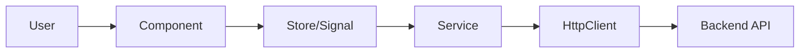

# Frontend Architecture - TTB Label Verification App

**Framework:** Angular 19 (LTS) with TypeScript
**State Management:** @ngrx/signals
**Purpose:** User interface for label verification workflow

---

## Architecture Overview



---

## Project Structure

```
src/
├── app/
│   ├── core/
│   │   └── services/
│   │       └── api.service.ts
│   │
│   ├── shared/
│   │   ├── models/
│   │   ├── enums/
│   │   ├── constants/
│   │   └── components/
│   │
│   └── features/
│       └── label-verification/
│           ├── components/
│           ├── pages/
│           ├── services/
│           └── store/
│
└── environments/
```

---

## Architecture Layers

### Core Layer
**Purpose:** Global singleton services

- **ApiService** - HttpClient wrapper with interceptors

### Shared Layer
**Purpose:** Reusable code across features

- **Models** - TypeScript interfaces (contracts)
- **Enums** - Application enumerations
- **Constants** - Shared constants (e.g., icons)
- **Components** - Shared components (e.g., toast-container)

**Note:** Validators are handled via Angular's built-in `Validators` from `@angular/forms`. Test data generators (fakers) are not currently implemented as they are optional for MVP.

### Feature Layer
**Purpose:** Label verification feature

**Components:**
- Form component
- Upload component
- Results component

**Pages:**
- Verification page (container)

**Services:**
- Verification service (API calls)

**Store:**
- Verification store (@ngrx/signals)
- State management for form, image, results

---

## State Management with @ngrx/signals

### Verification Store

**State:**
- formData
- imageFile
- isSubmitting
- verificationResult
- error

**Methods:**
- setFormData()
- setImage()
- submitVerification()
- reset()

**Computed:**
- canSubmit (derived from formData + imageFile)
- hasResults (derived from verificationResult)

---

## Design Principles

1. **Component-Based** - Angular components
2. **Reactive State** - @ngrx/signals for state
3. **Type Safety** - TypeScript throughout
4. **Unidirectional Data Flow** - Components → Store → Service → API
5. **Dependency Injection** - Angular DI

---

## Detailed Layer Documentation

Each layer has its own detailed documentation file:

- **[Core Layer](../frontend/src/app/core/core.md)** - Auth and toast services
- **[Shared Layer](../frontend/src/app/shared/shared.md)** - Models, enums, constants, components
- **[Label Verification Feature](../frontend/src/app/features/label-verification/label-verification.md)** - Main verification workflow with components, services, and store
- **[Admin Feature](../frontend/src/app/features/admin/admin.md)** - Admin dashboard, submission review, and authentication
